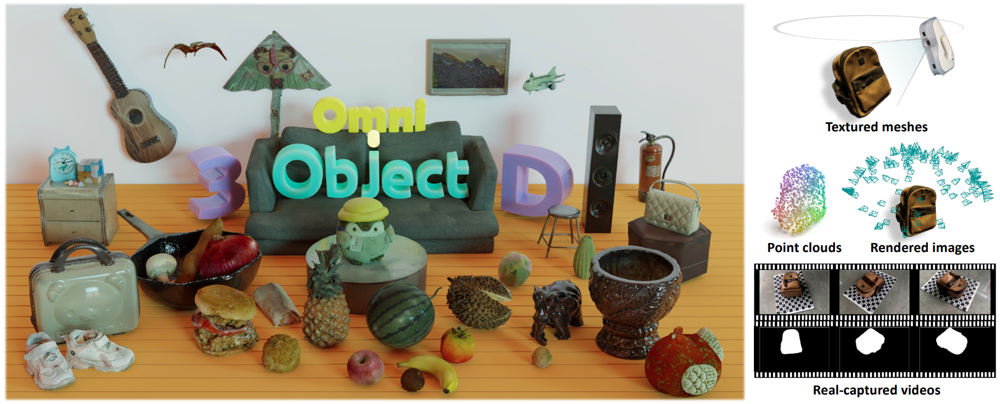

# OmniObject3D


<div align="center">

<h1> Large-Vocabulary 3D Object Dataset for Realistic Perception, Reconstruction and Generation
</h1>

<div>
    <a href='https://wutong16.github.io/' target='_blank'>Tong Wu</a>&emsp;
    Jiarui Zhang&emsp;
    <a href='https://fuxiao0719.github.io/' target='_blank'>Xiao Fu</a>&emsp;
    Yuxin Wang&emsp;
    <a href='https://jiawei-ren.github.io/' target='_blank'>Jiawei Ren</a>&emsp;
    <a href='https://scholar.google.com/citations?user=lSDISOcAAAAJ&hl=zh-CN' target='_blank'>Liang Pan</a>&emsp;<br>
    <a href='https://wywu.github.io/' target='_blank'>Wayne Wu</a>&emsp;
    <a href='https://scholar.google.com.hk/citations?user=jZH2IPYAAAAJ&hl=en' target='_blank'>Lei Yang</a>&emsp;
    <a href='https://myownskyw7.github.io/' target='_blank'>Jiaqi Wang</a>&emsp;
    <a href='https://scholar.google.com/citations?view_op=list_works&hl=zh-CN&hl=zh-CN&user=AerkT0YAAAAJ&sortby=pubdate' target='_blank'>Chen Qian</a>&emsp;
    <a href='https://scholar.google.com/citations?user=GMzzRRUAAAAJ&hl=zh-CN' target='_blank'>Dahua Lin&#9993</a>&emsp;
    <a href='https://liuziwei7.github.io/' target='_blank'>Ziwei Liu&#9993</a>&emsp;
</div>
    
<strong>Accepted to <a href='https://cvpr2023.thecvf.com/' target='_blank'>CVPR 2023</a> as Award Candidate </strong> :partying_face:

<strong><a href='https://omniobject3d.github.io/' target='_blank'>Project</a>&emsp;</strong>
<strong><a href='https://arxiv.org/abs/2301.07525' target='_blank'>Paper</a>&emsp;</strong>
<strong><a href='https://opendatalab.com/OpenXD-OmniObject3D-New/download' target='_blank'>Data</a></strong>
</div>



## Updates
- [09/2023] Language annotations by human experts are released [here](https://drive.google.com/file/d/1R-kC3EdMZmwyaX0EkU7CvZK8VSVRPMaS/view?usp=drive_link).
- [08/2023] Our challenge for ICCV 2023 is now live! For more details, please check it out [here](https://omniobject3d.github.io/challenge.html).
- [06/2023] Training set of OmniObject3D released!
## Usage

### Download the dataset

- Sign up [here](https://sso.openxlab.org.cn/login).
- Install OpenDataLab's CLI tools through `pip install openxlab`.
- View and download the dataset from the command line:

```bash
openxlab login                                                        # Login, input AK/SK
openxlab dataset info --dataset-repo OpenXDLab/OmniObject3D-New       # View dataset info
openxlab dataset ls --dataset-repo OpenXDLab/OmniObject3D-New	      # View a list of dataset files
openxlab dataset get --dataset-repo OpenXDLab/OmniObject3D-New        # Download the whole dataset (the compressed files require approximately 1.2TB of storage)
```

You can check out the full folder structure on the website above and download a certain portion of the data by specifying the path. For example:

```bash
openxlab dataset download --dataset-repo OpenXDLab/OmniObject3D-New \
                          --source-path /raw/point_clouds/ply_files \
                          --target-path <your-target-path> 
```

For more information, please refer to the [documentation](https://openxlab.org.cn/docs/developers/%E6%95%B0%E6%8D%AE%E9%9B%86/%E6%95%B0%E6%8D%AE%E9%9B%86CLI%EF%BC%88%E5%91%BD%E4%BB%A4%E8%A1%8C%E5%B7%A5%E5%85%B7%EF%BC%89.html).

We are also maintaining the dataset on [Google Drive](https://drive.google.com/drive/u/2/folders/1-hlkTqUJR_J2xht1qztmX2xAq_qNw4vn).

### Batch untar
To batch-untar a specific folder of compressed files based on your requirements, use the command `bash batch_untar.sh <folder_name>`. 
If the untar operation is completed successfully, remove all compressed files through `rm -rf <folder_name>/*.tar.gz`.

### Dataset format

```
OmniObject3D_Data_Root
    ├── raw_scans               
    │   ├── <category_name>
    │   │   ├── <object_id>
    │   │   │   ├── Scan
    │   │   │   │   ├── Scan.obj
    │   │   │   │   ├── Scan.mtl
    │   │   │   │   ├── Scan.jpg
    
    ├── blender_renders         
    │   ├── <category_name>
    │   │   ├── <object_id>
    │   │   │   ├── render
    │   │   │   │   ├── images
    │   │   │   │   ├── depths
    │   │   │   │   ├── normals
    │   │   │   │   ├── transforms.json    
    
    ├── videos_processed       
    │   ├── <category_name>
    │   │   ├── <object_id>
    │   │   │   ├── standard
    │   │   │   │   ├── images
    │   │   │   │   ├── matting
    │   │   │   │   ├── poses_bounds.npy           # raw results from colmap
    │   │   │   │   ├── poses_bounds_rescaled.npy  # rescaled to world-scale
    │   │   │   │   ├── sparse

    ├── point_clouds    
    │   ├── hdf5_files
    │   │   ├── 1024
    │   │   ├── 4096
    │   │   ├── 16384
    │   ├── ply_files
    │   │   ├── 1024
    │   │   ├── 4096
    │   │   ├── 16384
```
## Benchmarks
Please find the examplar usage of the data for the benchmarks [here](https://github.com/omniobject3d/OmniObject3D/tree/main/benchmarks/).

## TODO
- [x] Language annotations.

## License
The OmniObject3D dataset is released under the [CC BY 4.0](https://creativecommons.org/licenses/by/4.0/).

## Reference
If you find our dataset useful in your research, please use the following citation:
```
@inproceedings{wu2023omniobject3d,
    author = {Tong Wu and Jiarui Zhang and Xiao Fu and Yuxin Wang and Jiawei Ren, 
    Liang Pan and Wayne Wu and Lei Yang and Jiaqi Wang and Chen Qian and Dahua Lin and Ziwei Liu},
    title = {OmniObject3D: Large-Vocabulary 3D Object Dataset for Realistic Perception, 
    Reconstruction and Generation},
    booktitle={IEEE/CVF Conference on Computer Vision and Pattern Recognition (CVPR)},
    year={2023}
}
```
